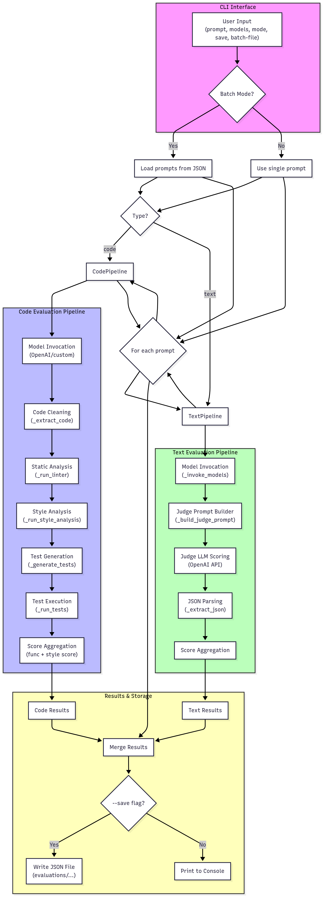

# LLM-as-Judge: Multi-LLM Evaluation Framework

A comprehensive framework for evaluating and comparing code and text generation from multiple Large Language Models (LLMs) using a judge LLM.



## 🏗️ Architecture Overview

The framework has been refactored into a modular, maintainable structure:

```
llm_judge/
├── config.py                 # Centralized configuration and constants
├── evaluator.py              # Abstract base class for evaluators
├── main.py                   # New main entry point
├── cli.py                    # CLI interface (legacy)
├── utils/                    # Utility modules
│   ├── cost_tracker.py       # Cost tracking and calculation
│   ├── code_analysis.py      # Code linting, style, and security analysis
│   ├── test_runner.py        # Test generation and execution
│   └── judge_analyzer.py     # Judge LLM analysis and reasoning
├── pipelines/                # Evaluation pipelines
│   ├── base_pipeline.py      # Common pipeline functionality
│   ├── code_pipeline.py      # Code evaluation pipeline
│   └── text_pipeline.py      # Text evaluation pipeline
└── batch_prompts/            # Batch evaluation prompts
    ├── batch_code_prompts.json
    └── batch_text_prompts.json
```

## 🚀 Key Features

### 🔧 **Modular Architecture**
- **Separation of Concerns**: Each component has a single responsibility
- **Reusable Utilities**: Common functionality shared across pipelines
- **Easy Maintenance**: Clear structure makes debugging and enhancement simple
- **Extensible Design**: Easy to add new evaluation types or utilities

### 💰 **Cost Tracking**
- Real-time cost calculation for all API calls
- Detailed breakdown by model and call type
- Support for current OpenAI pricing
- Cost summary display after each evaluation

### 🧠 **Detailed Reasoning**
- Judge LLM provides comprehensive analysis
- Winner/loser reasoning with specific strengths/weaknesses
- Code quality assessment with multiple metrics
- Test performance analysis

### 🧪 **Comprehensive Code Evaluation**
- **Syntax Analysis**: Validates Python code structure
- **Security Scanning**: Identifies potential security issues using Bandit
- **Style Assessment**: Pylint scoring and cyclomatic complexity analysis
- **Test Generation**: AI-generated test cases for functionality validation
- **Automated Testing**: Runs generated tests and reports pass/fail rates

### 📝 **Text Evaluation**
- **Correctness Scoring**: Factual accuracy assessment
- **Relevance Scoring**: How well the response addresses the prompt
- **Detailed Analysis**: Specific reasoning for each response
- **Comparative Assessment**: Direct comparison between models

## 🛠️ Installation

1. **Clone the repository**:
   ```bash
   git clone <repository-url>
   cd llm_judge
   ```

2. **Install dependencies**:
   ```bash
   pip install -r requirements.txt
   ```

3. **Set up environment variables**:
   ```bash
   export OPENAI_API_KEY="your-api-key-here"
   ```

4. **Install additional tools** (for code analysis):
   ```bash
   pip install bandit pylint radon
   ```

## 📖 Usage

### Basic Usage

**Code Evaluation**:
```bash
python -m llm_judge.main "Write a function to calculate fibonacci numbers" -m gpt-4 -m gpt-3.5-turbo -t code
```

**Text Evaluation**:
```bash
python -m llm_judge.main "Explain quantum computing in simple terms" -m gpt-4 -m gpt-3.5-turbo -t text
```

### Advanced Options

**With Custom Judge Model**:
```bash
python -m llm_judge.main "Your prompt here" -m gpt-4 -m gpt-3.5-turbo -t code --judge-model gpt-4-turbo
```

**Batch Evaluation**:
```bash
python -m llm_judge.main "placeholder" -m gpt-4 -m gpt-3.5-turbo -t code --batch-file batch_prompts/batch_code_prompts.json --save
```

**Save Results**:
```bash
python -m llm_judge.main "Your prompt" -m gpt-4 -m gpt-3.5-turbo -t code --save
```

## 🔍 Understanding the Output

### Code Evaluation Results
```
🔍 Evaluating model: gpt-4
🤖 Asking Judge LLM to generate tests...
⚙️ Running unit tests...
💰 Cost for gpt-4 (model): $0.0123 (150 input, 200 output tokens)

🏆 JUDGE'S DETAILED CODE ANALYSIS
============================================================
📊 GPT-4 ANALYSIS:
   Final Score: 0.85
   Tests: 8 passed, 2 failed
   Style Score: 0.92
   Pylint: 9.2/10
   Complexity: 2.1
   Security Issues: 0
   Code Quality: Excellent structure with clear function definition
   Test Performance: Handles edge cases well with 80% pass rate
   Security Analysis: No security vulnerabilities detected
   Style Assessment: Follows PEP 8 guidelines consistently
   Strengths: Clean code, good documentation, efficient algorithm
   Weaknesses: Could handle negative numbers better

🥇 WINNER (gpt-4):
   This code demonstrates excellent structure, comprehensive test coverage,
   and follows Python best practices consistently.

💰 COST SUMMARY
============================================================
📊 MODEL CALLS:
   gpt-4: 1 calls, $0.0123
   gpt-3.5-turbo: 1 calls, $0.0034

🧠 JUDGE CALLS:
   gpt-4: 2 calls, $0.0246

💵 TOTAL COST: $0.0403
============================================================
```

### Text Evaluation Results
```
🏆 JUDGE'S DETAILED ANALYSIS
============================================================
📊 GPT-4 ANALYSIS:
   Correctness: 5/5
   Relevance: 5/5
   Reasoning: Comprehensive and accurate explanation with clear examples

🥇 WINNER (gpt-4):
   Provides the most accurate and comprehensive explanation with
   excellent clarity and depth of understanding.

🥈 RUNNER-UP (gpt-3.5-turbo):
   Good basic explanation but lacks the depth and technical accuracy
   of the winning response.
============================================================
```

## 🏗️ Architecture Details

### Core Components

#### 1. **Configuration (`config.py`)**
- Centralized settings and constants
- Cost per token configurations
- Evaluation weights and parameters
- File paths and CLI settings

#### 2. **Base Pipeline (`pipelines/base_pipeline.py`)**
- Common functionality for all pipelines
- Model invocation with cost tracking
- Response display and utility methods
- Cost management

#### 3. **Code Pipeline (`pipelines/code_pipeline.py`)**
- Inherits from `BasePipeline` and `Evaluator`
- Orchestrates code evaluation workflow
- Integrates all code analysis utilities
- Provides detailed evaluation results

#### 4. **Text Pipeline (`pipelines/text_pipeline.py`)**
- Inherits from `BasePipeline` and `Evaluator`
- Handles text evaluation workflow
- Uses judge analyzer for detailed reasoning
- Returns structured evaluation results

### Utility Modules

#### 1. **Cost Tracker (`utils/cost_tracker.py`)**
- Real-time cost calculation
- Detailed cost breakdown
- Support for multiple models
- Cost summary display

#### 2. **Code Analysis (`utils/code_analysis.py`)**
- Syntax validation using `py_compile`
- Security analysis with Bandit
- Style assessment with Pylint
- Cyclomatic complexity calculation

#### 3. **Test Runner (`utils/test_runner.py`)**
- AI-generated test case creation
- Test execution and result parsing
- Error handling and reporting
- Integration with judge model

#### 4. **Judge Analyzer (`utils/judge_analyzer.py`)**
- Detailed reasoning generation
- Structured analysis output
- Winner/loser determination
- Display formatting

## 🔧 Customization

### Adding New Evaluation Types
1. Create a new pipeline class inheriting from `BasePipeline`
2. Implement the `evaluate` method
3. Add any specialized utilities to the `utils/` directory
4. Update the CLI to support the new type

### Modifying Evaluation Criteria
1. Update weights in `config.py`
2. Modify analysis methods in utility modules
3. Adjust judge prompts in `judge_analyzer.py`

### Adding New Models
1. Add pricing information to `COST_PER_1K_TOKENS` in `config.py`
2. Update any model-specific logic in pipelines
3. Test with the new model

## 🧪 Testing

Run the test suite:
```bash
python -m pytest tests/
```

## 📊 Performance Considerations

- **Cost Optimization**: Use appropriate models for different tasks
- **Batch Processing**: Use batch files for multiple evaluations
- **Caching**: Consider implementing response caching for repeated prompts
- **Parallel Processing**: Future enhancement for concurrent model evaluation

## 🤝 Contributing

1. Fork the repository
2. Create a feature branch
3. Follow the modular architecture principles
4. Add tests for new functionality
5. Update documentation
6. Submit a pull request

## 📄 License

This project is licensed under the MIT License - see the LICENSE file for details.

## 🙏 Acknowledgments

- OpenAI for providing the API
- The open-source community for tools like Bandit, Pylint, and Radon
- Contributors and users of the framework

---

**Note**: This framework is designed for research and evaluation purposes. Always review generated code and text before using in production environments.